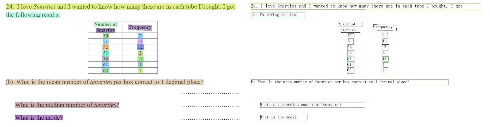

自用PP——structure：

一、简单使用：

1.识别图片和表格并输出：PaddleOCR-release-2.6\Multi_Pic，图片以jpg文件格式保存；表格以Excel格式保存
 
2.识别文字并输出：PaddleOCR-release-2.6\tools\infer\predict_system，文字输出格式为doc
 
二、文件保存：

1.图片与表格保存地址在PaddleOCR-release-2.6\Save_picAexcel\table中，并且有对应名称的文件夹保存

2.文字保存地址在PaddleOCR-release-2.6\Save_txt，以对应名称保存

三、参数设置与图片导入：

目标图片位置为PaddleOCR-release-2.6\doc\imgs_target，并且要注意命名格式，图片格式可以为jpg、png等等格式

参数设置文件为PaddleOCR-release-2.6\tools\infer\utility；
可以更改det、rec、cls模板文件、
可以更改文件读取位置、文件结果输出位置等等

English | [简体中文](README_ch.md) | [हिन्दी](./doc/doc_i18n/README_हिन्द.md) | [日本語](./doc/doc_i18n/README_日本語.md) | [한국인](./doc/doc_i18n/README_한국어.md) | [Pу́сский язы́к](./doc/doc_i18n/README_Ру́сский_язы́к.md)

 

    
    
    
    
    
    
    

## Introduction

PaddleOCR aims to create multilingual, awesome, leading, and practical OCR tools that help users train better models and apply them into practice.

    

    

## 📣 Recent updates
- 🔨**2022.11 Add implementation of [4 cutting-edge algorithms](doc/doc_ch/algorithm_overview.md)**：Text Detection [DRRG](doc/doc_en/algorithm_det_drrg_en.md),  Text Recognition [RFL](./doc/doc_en/algorithm_rec_rfl_en.md), Image Super-Resolution [Text Telescope](doc/doc_en/algorithm_sr_telescope_en.md)，Handwrittem Mathematical Expression Recognition [CAN](doc/doc_en/algorithm_rec_can_en.md)
- **2022.10 Release [optimized JS version PP-OCRv3 model](./deploy/paddlejs/README.md)** with 4.3M model size, 8x faster inference time, and a ready-to-use web demo

- 💥 **Live Playback: Introduction to PP-StructureV2 optimization strategy**. Scan [the QR code below](#Community) using WeChat, follow the PaddlePaddle official account and fill out the questionnaire to join the WeChat group, get the live link and 20G OCR learning materials (including PDF2Word application, 10 models in vertical scenarios, etc.)

- **🔥2022.8.24 Release PaddleOCR [release/2.6](https://github.com/PaddlePaddle/PaddleOCR/tree/release/2.6)**
  - Release [PP-StructureV2](./ppstructure/)，with functions and performance fully upgraded, adapted to Chinese scenes, and new support for [Layout Recovery](./ppstructure/recovery) and **one line command to convert PDF to Word**;
  - [Layout Analysis](./ppstructure/layout) optimization: model storage reduced by 95%, while speed increased by 11 times, and the average CPU time-cost is only 41ms;
  - [Table Recognition](./ppstructure/table) optimization: 3 optimization strategies are designed, and the model accuracy is improved by 6% under comparable time consumption;
  - [Key Information Extraction](./ppstructure/kie) optimization：a visual-independent model structure is designed, the accuracy of semantic entity recognition is increased by 2.8%, and the accuracy of relation extraction is increased by 9.1%.
- **🔥2022.8 Release [OCR scene application collection](./applications/README_en.md)**
    - Release **9 vertical models** such as digital tube, LCD screen, license plate, handwriting recognition model, high-precision SVTR model, etc, covering the main OCR vertical applications in general, manufacturing, finance, and transportation industries.
- **2022.8 Add implementation of [8 cutting-edge algorithms](doc/doc_en/algorithm_overview_en.md)**
  - Text Detection: [FCENet](doc/doc_en/algorithm_det_fcenet_en.md), [DB++](doc/doc_en/algorithm_det_db_en.md)
  - Text Recognition: [ViTSTR](doc/doc_en/algorithm_rec_vitstr_en.md), [ABINet](doc/doc_en/algorithm_rec_abinet_en.md), [VisionLAN](doc/doc_en/algorithm_rec_visionlan_en.md), [SPIN](doc/doc_en/algorithm_rec_spin_en.md), [RobustScanner](doc/doc_en/algorithm_rec_robustscanner_en.md)
  - Table Recognition: [TableMaster](doc/doc_en/algorithm_table_master_en.md)
- **2022.5.9 Release PaddleOCR [release/2.5](https://github.com/PaddlePaddle/PaddleOCR/tree/release/2.5)**
    - Release [PP-OCRv3](./doc/doc_en/ppocr_introduction_en.md#pp-ocrv3): With comparable speed, the effect of Chinese scene is further improved by 5% compared with PP-OCRv2, the effect of English scene is improved by 11%, and the average recognition accuracy of 80 language multilingual models is improved by more than 5%.
    - Release [PPOCRLabelv2](./PPOCRLabel): Add the annotation function for table recognition task, key information extraction task and irregular text image.
    - Release interactive e-book [*"Dive into OCR"*](./doc/doc_en/ocr_book_en.md), covers the cutting-edge theory and code practice of OCR full stack technology.
- [more](./doc/doc_en/update_en.md)

## 🌟 Features

PaddleOCR support a variety of cutting-edge algorithms related to OCR, and developed industrial featured models/solution [PP-OCR](./doc/doc_en/ppocr_introduction_en.md) and [PP-Structure](./ppstructure/README.md) on this basis, and get through the whole process of data production, model training, compression, inference and deployment.

    

> It is recommended to start with the “quick experience” in the document tutorial

## ⚡ Quick Experience

- Web online experience for the ultra-lightweight OCR: [Online Experience](https://www.paddlepaddle.org.cn/hub/scene/ocr)
- Mobile DEMO experience (based on EasyEdge and Paddle-Lite, supports iOS and Android systems): [Sign in to the website to obtain the QR code for  installing the App](https://ai.baidu.com/easyedge/app/openSource?from=paddlelite)
- One line of code quick use: [Quick Start](./doc/doc_en/quickstart_en.md)

## 📚 E-book: *Dive Into OCR*
- [Dive Into OCR ](./doc/doc_en/ocr_book_en.md)

## 👫 Community

- For international developers, we regard [PaddleOCR Discussions](https://github.com/PaddlePaddle/PaddleOCR/discussions) as our international community platform. All ideas and questions can be discussed here in English.

- For Chinese develops, Scan the QR code below with your Wechat, you can join the official technical discussion group. For richer community content, please refer to [中文README](README_ch.md), looking forward to your participation.

## 🛠️ PP-OCR Series Model List（Update on September 8th）

| Model introduction                                           | Model name                   | Recommended scene | Detection model                                              | Direction classifier                                         | Recognition model                                            |
| ------------------------------------------------------------ | ---------------------------- | ----------------- | ------------------------------------------------------------ | ------------------------------------------------------------ | ------------------------------------------------------------ |
| Chinese and English ultra-lightweight PP-OCRv3 model（16.2M）     | ch_PP-OCRv3_xx          | Mobile & Server | [inference model](https://paddleocr.bj.bcebos.com/PP-OCRv3/chinese/ch_PP-OCRv3_det_infer.tar) / [trained model](https://paddleocr.bj.bcebos.com/PP-OCRv3/chinese/ch_PP-OCRv3_det_distill_train.tar) | [inference model](https://paddleocr.bj.bcebos.com/dygraph_v2.0/ch/ch_ppocr_mobile_v2.0_cls_infer.tar) / [trained model](https://paddleocr.bj.bcebos.com/dygraph_v2.0/ch/ch_ppocr_mobile_v2.0_cls_train.tar) | [inference model](https://paddleocr.bj.bcebos.com/PP-OCRv3/chinese/ch_PP-OCRv3_rec_infer.tar) / [trained model](https://paddleocr.bj.bcebos.com/PP-OCRv3/chinese/ch_PP-OCRv3_rec_train.tar) |
| English ultra-lightweight PP-OCRv3 model（13.4M）     | en_PP-OCRv3_xx          | Mobile & Server | [inference model](https://paddleocr.bj.bcebos.com/PP-OCRv3/english/en_PP-OCRv3_det_infer.tar) / [trained model](https://paddleocr.bj.bcebos.com/PP-OCRv3/english/en_PP-OCRv3_det_distill_train.tar) | [inference model](https://paddleocr.bj.bcebos.com/dygraph_v2.0/ch/ch_ppocr_mobile_v2.0_cls_infer.tar) / [trained model](https://paddleocr.bj.bcebos.com/dygraph_v2.0/ch/ch_ppocr_mobile_v2.0_cls_train.tar) | [inference model](https://paddleocr.bj.bcebos.com/PP-OCRv3/english/en_PP-OCRv3_rec_infer.tar) / [trained model](https://paddleocr.bj.bcebos.com/PP-OCRv3/english/en_PP-OCRv3_rec_train.tar) |
| Chinese and English ultra-lightweight PP-OCRv2 model（11.6M） |  ch_PP-OCRv2_xx |Mobile & Server|[inference model](https://paddleocr.bj.bcebos.com/PP-OCRv2/chinese/ch_PP-OCRv2_det_infer.tar) / [trained model](https://paddleocr.bj.bcebos.com/PP-OCRv2/chinese/ch_PP-OCRv2_det_distill_train.tar)| [inference model](https://paddleocr.bj.bcebos.com/dygraph_v2.0/ch/ch_ppocr_mobile_v2.0_cls_infer.tar) / [trained model](https://paddleocr.bj.bcebos.com/dygraph_v2.0/ch/ch_ppocr_mobile_v2.0_cls_train.tar) |[inference model](https://paddleocr.bj.bcebos.com/PP-OCRv2/chinese/ch_PP-OCRv2_rec_infer.tar) / [trained model](https://paddleocr.bj.bcebos.com/PP-OCRv2/chinese/ch_PP-OCRv2_rec_train.tar)|
| Chinese and English ultra-lightweight PP-OCR model (9.4M)       | ch_ppocr_mobile_v2.0_xx      | Mobile & server   |[inference model](https://paddleocr.bj.bcebos.com/dygraph_v2.0/ch/ch_ppocr_mobile_v2.0_det_infer.tar) / [trained model](https://paddleocr.bj.bcebos.com/dygraph_v2.0/ch/ch_ppocr_mobile_v2.0_det_train.tar)|[inference model](https://paddleocr.bj.bcebos.com/dygraph_v2.0/ch/ch_ppocr_mobile_v2.0_cls_infer.tar) / [trained model](https://paddleocr.bj.bcebos.com/dygraph_v2.0/ch/ch_ppocr_mobile_v2.0_cls_train.tar) |[inference model](https://paddleocr.bj.bcebos.com/dygraph_v2.0/ch/ch_ppocr_mobile_v2.0_rec_infer.tar) / [trained model](https://paddleocr.bj.bcebos.com/dygraph_v2.0/ch/ch_ppocr_mobile_v2.0_rec_train.tar)      |
| Chinese and English general PP-OCR model (143.4M)               | ch_ppocr_server_v2.0_xx      | Server            |[inference model](https://paddleocr.bj.bcebos.com/dygraph_v2.0/ch/ch_ppocr_server_v2.0_det_infer.tar) / [trained model](https://paddleocr.bj.bcebos.com/dygraph_v2.0/ch/ch_ppocr_server_v2.0_det_train.tar)    |[inference model](https://paddleocr.bj.bcebos.com/dygraph_v2.0/ch/ch_ppocr_mobile_v2.0_cls_infer.tar) / [trained model](https://paddleocr.bj.bcebos.com/dygraph_v2.0/ch/ch_ppocr_mobile_v2.0_cls_train.tar)    |[inference model](https://paddleocr.bj.bcebos.com/dygraph_v2.0/ch/ch_ppocr_server_v2.0_rec_infer.tar) / [trained model](https://paddleocr.bj.bcebos.com/dygraph_v2.0/ch/ch_ppocr_server_v2.0_rec_train.tar)  |

- For more model downloads (including multiple languages), please refer to [PP-OCR series model downloads](./doc/doc_en/models_list_en.md).
- For a new language request, please refer to [Guideline for new language_requests](#language_requests).
- For structural document analysis models, please refer to [PP-Structure models](./ppstructure/docs/models_list_en.md).

## 📖 Tutorials
- [Environment Preparation](./doc/doc_en/environment_en.md)
- [PP-OCR 🔥](./doc/doc_en/ppocr_introduction_en.md)
    - [Quick Start](./doc/doc_en/quickstart_en.md)
    - [Model Zoo](./doc/doc_en/models_en.md)
    - [Model training](./doc/doc_en/training_en.md)
        - [Text Detection](./doc/doc_en/detection_en.md)
        - [Text Recognition](./doc/doc_en/recognition_en.md)
        - [Text Direction Classification](./doc/doc_en/angle_class_en.md)
    - Model Compression
        - [Model Quantization](./deploy/slim/quantization/README_en.md)
        - [Model Pruning](./deploy/slim/prune/README_en.md)
        - [Knowledge Distillation](./doc/doc_en/knowledge_distillation_en.md)
    - [Inference and Deployment](./deploy/README.md)
        - [Python Inference](./doc/doc_en/inference_ppocr_en.md)
        - [C++ Inference](./deploy/cpp_infer/readme.md)
        - [Serving](./deploy/pdserving/README.md)
        - [Mobile](./deploy/lite/readme.md)
        - [Paddle2ONNX](./deploy/paddle2onnx/readme.md)
        - [PaddleCloud](./deploy/paddlecloud/README.md)
        - [Benchmark](./doc/doc_en/benchmark_en.md)  
- [PP-Structure 🔥](./ppstructure/README.md)
    - [Quick Start](./ppstructure/docs/quickstart_en.md)
    - [Model Zoo](./ppstructure/docs/models_list_en.md)
    - [Model training](./doc/doc_en/training_en.md)  
        - [Layout Analysis](./ppstructure/layout/README.md)
        - [Table Recognition](./ppstructure/table/README.md)
        - [Key Information Extraction](./ppstructure/kie/README.md)
    - [Inference and Deployment](./deploy/README.md)
        - [Python Inference](./ppstructure/docs/inference_en.md)
        - [C++ Inference](./deploy/cpp_infer/readme.md)
        - [Serving](./deploy/hubserving/readme_en.md)
- [Academic Algorithms](./doc/doc_en/algorithm_overview_en.md)
    - [Text detection](./doc/doc_en/algorithm_overview_en.md)
    - [Text recognition](./doc/doc_en/algorithm_overview_en.md)
    - [End-to-end OCR](./doc/doc_en/algorithm_overview_en.md)
    - [Table Recognition](./doc/doc_en/algorithm_overview_en.md)
    - [Key Information Extraction](./doc/doc_en/algorithm_overview_en.md)  
    - [Add New Algorithms to PaddleOCR](./doc/doc_en/add_new_algorithm_en.md)
- Data Annotation and Synthesis
    - [Semi-automatic Annotation Tool: PPOCRLabel](./PPOCRLabel/README.md)
    - [Data Synthesis Tool: Style-Text](./StyleText/README.md)
    - [Other Data Annotation Tools](./doc/doc_en/data_annotation_en.md)
    - [Other Data Synthesis Tools](./doc/doc_en/data_synthesis_en.md)
- Datasets
    - [General OCR Datasets(Chinese/English)](doc/doc_en/dataset/datasets_en.md)
    - [HandWritten_OCR_Datasets(Chinese)](doc/doc_en/dataset/handwritten_datasets_en.md)
    - [Various OCR Datasets(multilingual)](doc/doc_en/dataset/vertical_and_multilingual_datasets_en.md)
    - [Layout Analysis](doc/doc_en/dataset/layout_datasets_en.md)
    - [Table Recognition](doc/doc_en/dataset/table_datasets_en.md)
    - [Key Information Extraction](doc/doc_en/dataset/kie_datasets_en.md)
- [Code Structure](./doc/doc_en/tree_en.md)
- [Visualization](#Visualization)
- [Community](#Community)
- [New language requests](#language_requests)
- [FAQ](./doc/doc_en/FAQ_en.md)
- [References](./doc/doc_en/reference_en.md)
- [License](#LICENSE)

## 👀 Visualization [more](./doc/doc_en/visualization_en.md)

PP-OCRv3 Chinese model

    
    
    

PP-OCRv3 English model

    
    

PP-OCRv3 Multilingual model

    
    

PP-StructureV2

- layout analysis + table recognition  

    

- SER (Semantic entity recognition)

    

    

    

- RE (Relation Extraction)

    

  

    

    

## 🇺🇳 Guideline for New Language Requests

If you want to request a new language support, a PR with 1 following files are needed：

1. In folder [ppocr/utils/dict](./ppocr/utils/dict),
it is necessary to submit the dict text to this path and name it with `{language}_dict.txt` that contains a list of all characters. Please see the format example from other files in that folder.

If your language has unique elements, please tell me in advance within any way, such as useful links, wikipedia and so on.

More details, please refer to [Multilingual OCR Development Plan](https://github.com/PaddlePaddle/PaddleOCR/issues/1048).

## 📄 License
This project is released under <a href="https://github.com/PaddlePaddle/PaddleOCR/blob/master/LICENSE">Apache 2.0 license</a>
